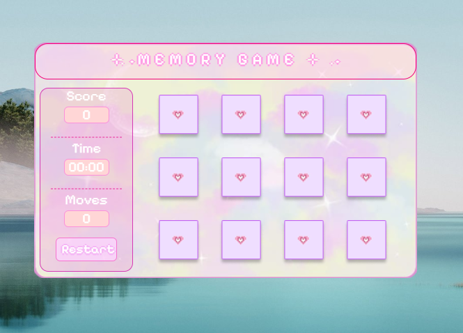
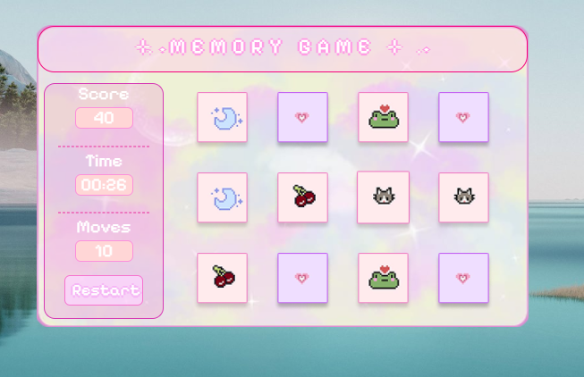
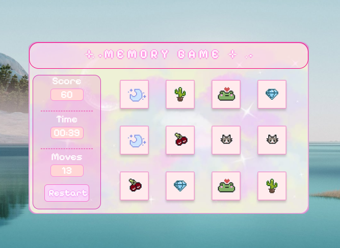

# Memory-Game

A cute desktop memory game built with HTML, CSS, JavaScript, and ElectronJS.  
This project features a soft pastel pixel-art inspired UI with animated memory card gameplay.

---
# Design File

Figma design file for this project:  
https://www.figma.com/design/3Tel8ojX8vYFNWF4FblDML/Untitled?node-id=0-1&t=5mExiE09mddbkkQU-1

---
# Project Structure

| File / Folder | Purpose |
|---|---|
| index.html | Main HTML layout for the game UI |
| style.css | Styling and animations |
| script.js | Memory game logic |
| main.js | Electron main process |
| preload.js | Electron preload configuration |
| package.json | Project dependencies and scripts |
| assets/ | Images, backgrounds, and card assets |

---
# How to use

## 1. Clone This Repo

```bash
[git clone https://github.com/your-username/memory-game.git](https://github.com/spandana-yellamelli/Memory-Game.git)

```

## 2. Install Node.js

Make sure you have Node.js installed, then run:

```bash
npm install
```

This installs Electron and all required dependencies.

---

## 3. Run the App Locally

```bash
npm run start
```

This will open the Memory Game as a desktop application powered by ElectronJS.

---

# Features

- Pastel pixel-themed UI
- Memory card matching system
- Score tracker
- Timer functionality
- Move counter
- Restart button
- Hover animations
- Electron desktop app support

---
# Built With

- HTML
- CSS
- JavaScript
- ElectronJS

---

# Live Website Version
This version was specially redesigned for browser play and public access.
Unlike the Electron.js version, this edition is optimized for web gameplay.

[https://your-memory-game.netlify.app](https://pixel-memorygame.netlify.app/)

---
# Preview









---

# Author

Spandana Yellamelli
